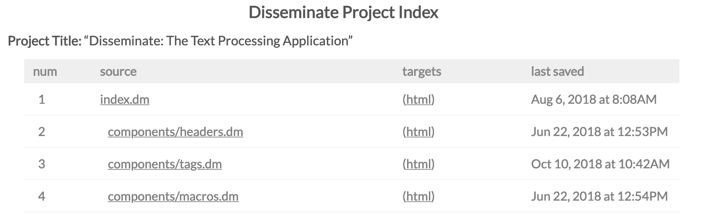

Web Server
==========

The web server produces a tree listing of the disseminate source document and
rendered target documents.

It can be used to organize and preview the rendering of documents. The
currently supported target formats for display are ``html`` and ``pdf``.